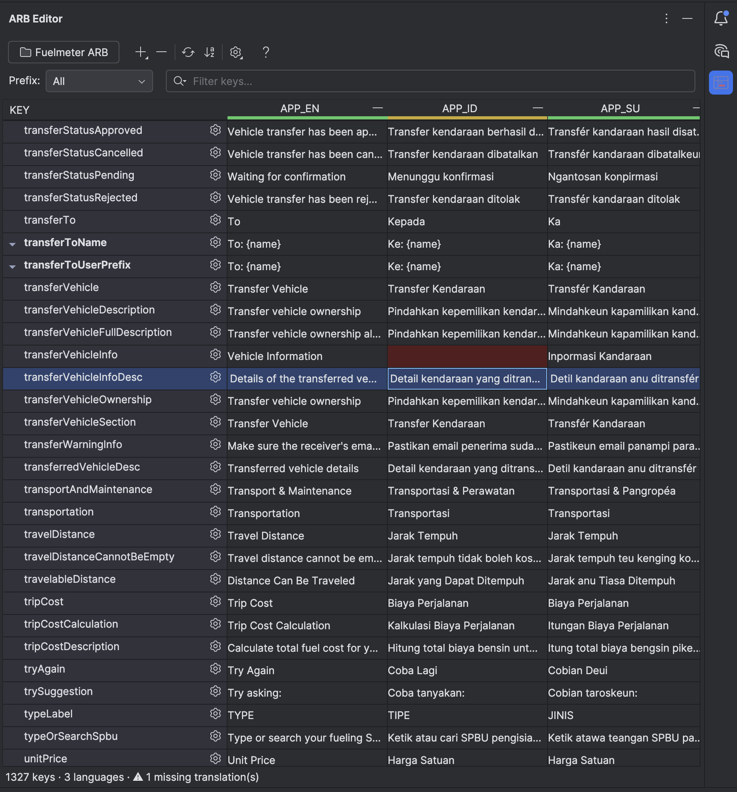
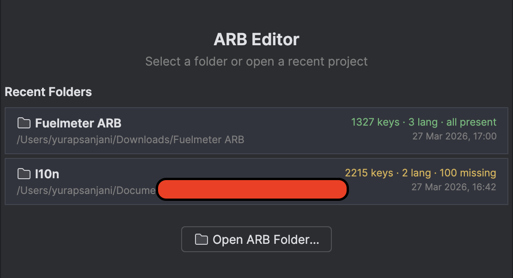
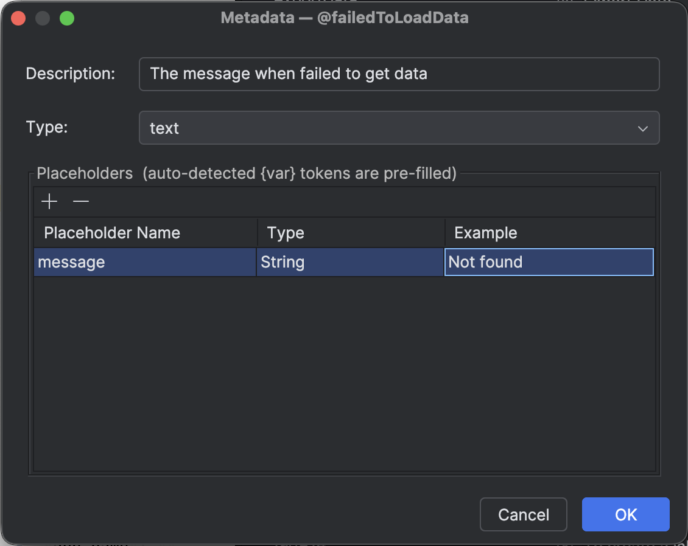
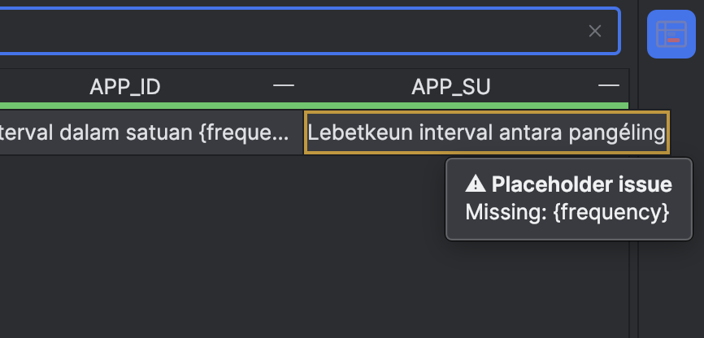
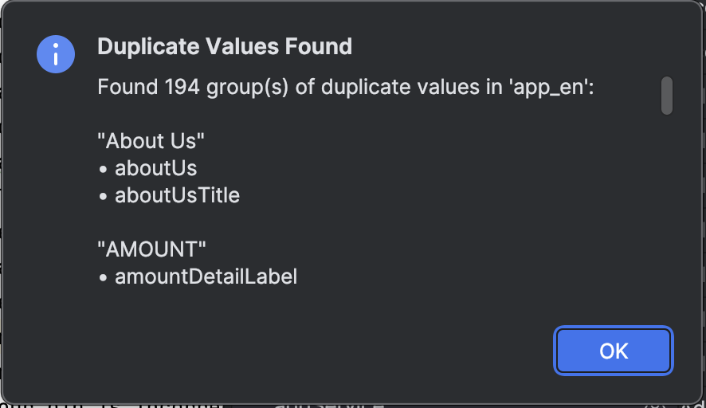

# ARB Editor

A powerful, synchronized ARB (Application Resource Bundle) translation editor built as an IntelliJ Platform plugin for Flutter developers.

Open any folder of `.arb` files and manage all language translations in a single, unified table view — right inside your IDE.

<!-- Plugin description -->
**ARB Editor** is a powerful, synchronized ARB (Application Resource Bundle) translation editor built for Flutter developers.
Open any folder of `.arb` files and manage all language translations in a single, unified table view — right inside your IDE.

### ✨ Key Features

| | Feature | Description |
|---|---|---|
| 📝 | **Synchronized Table Editor** | Edit all languages side-by-side in one table. Changes auto-save instantly to `.arb` files. |
| ⚠️ | **Missing Translation Detection** | Blank cells are highlighted in red so you never ship an incomplete translation. |
| 🔍 | **Placeholder Validation** | Validates that `{placeholder}` tokens match across all languages — prevents Flutter runtime crashes. |
| 📊 | **Translation Progress Bars** | Each language column header shows a color-coded completion bar (green / yellow / red). |
| 📥 | **Import & Export CSV** | Export translations for external translators, then import their CSV back with a merge preview. |
| ✏️ | **Key Rename / Refactor** | Rename a key across all `.arb` files at once, including `@key` metadata annotations. |
| 🔎 | **Duplicate Detection** | Find translation keys with identical values — catch copy-paste errors or consolidation opportunities. |
| 🏷️ | **Key Grouping & Prefix Filter** | Auto-groups keys by prefix (`home_`, `auth_`, `settings_`) for focused editing. |
| 📋 | **Metadata Editor** | Full `@key` annotation editor — description, type, and placeholders with auto-detection of `{var}` tokens. |
| 📂 | **Recent Folders & Welcome Screen** | Quick access to recent ARB folders with stats (keys, languages, missing count) at a glance. |

### 🛠️ More Tools

- **Sort A→Z** — Alphabetical key sorting across all files
- **Fill from Reference** — Copy a reference language into blank cells as a translation placeholder
- **Add / Delete Key** — Manage keys across all ARB files at once
- **Add / Delete Language** — Create or remove `.arb` language files
- **Copy Flutter Code** — Right-click to copy `AppLocalizations.of(context)!.keyName`
- **Expandable Metadata Rows** — Click ▾ to inline-preview description, type, and placeholders

### 📸 Screenshots

### 🚀 Getting Started

1. Open the **ARB Editor** tool window (right sidebar)
2. Click **"Select ARB Folder"** and choose your `lib/l10n/` directory
3. Edit translations directly in the table — changes save automatically

*Built with ❤️ for the Flutter community by Yusril Rapsanjani.*
<!-- Plugin description end -->

## Installation

- **JetBrains Marketplace** — Search for "ARB Editor" in <kbd>Settings</kbd> → <kbd>Plugins</kbd> → <kbd>Marketplace</kbd>.
- **Manual** — Download the latest release `.zip` from [Releases](https://github.com/yusriltakeuchi/arb-editor/releases) and install via <kbd>Settings</kbd> → <kbd>Plugins</kbd> → <kbd>⚙️</kbd> → <kbd>Install Plugin from Disk…</kbd>

## Requirements

- IntelliJ-based IDE **2025.2** or later (IntelliJ IDEA, Android Studio, etc.)

## License

Licensed under the [MIT License](LICENSE).
